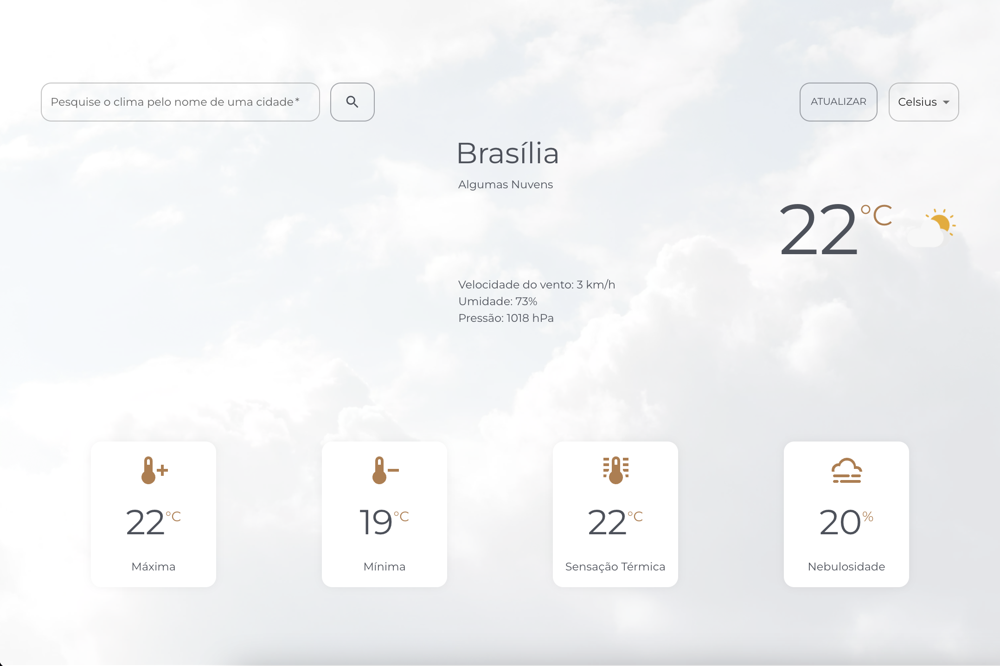

# Aplicação de visualização do clima de uma cidade

<br />

## Descrição

<br />
Esta aplicação tem o objetivo de mostrar informações referente ao clima de uma cidade como temperatura atual, temperatura máxima, temperatura mínima, nebulosidade, sensação térmica, velocidade do vento, percentagem da umidade e pressão.
<br/>
<br/>
É possível pesquisar o clima digitando o nome da cidade no canto superior esquerdo da tela ou permitindo que o sistema receba informações sobre a localização atual do usuário. 
<br />
<br />
Além desses recursos também é possível atualizar as informações clicando no botão localizado no canto superior direito da tela e também escolher qual a escala deseja visualizar a temperatura. As opções são Celsius, Fahrenheit e Kelvin.

<br />
<br />

## Link para acessar o sistema, clique no link abaixo:

https://weather-app-iota-nine.vercel.app/

Observação: O deploy da aplicação acontece automaticamente a cada commit na branch master.

<br />
<br />

## Imagem do sistema

<br />



<br />
<br />

## Como rodar o projeto

<br />

Na raiz do projeto, rode o comando no terminal:

<br />

```shell
yarn install
```

<br />

Depois crie um arquivo chamado `.env`  e copie para ela tudo que está no arquivo `.develop.env`.

<br />

Rode o seguinte comando para executar o sistema:

<br />

```shell
yarn start
```
